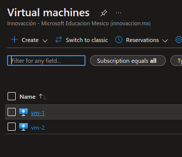

# Connecting two virtual machines and networks using the Microsoft Azure Portal

---------------------------------------------------------

## Requirements
- Microsoft Azure Account ( with funds or credits    )
- Microsoft Azure Suscription
- A web browser
- Access to internet

---------------------------------------------------------

## Instructions
#### 1. Login to the [Azure Portal](https://portal.azure.com/).
#### 2. Once you're on the portal's home page, you will see something like this:

#### 3. Inside the search bar (located at the top), look for *resource groups* and click on it.

#### 4. Click on *Create*.

#### 5. Select your subscription, the resource where you will locate the resource group and give it a name.

#### 6. Click *Review + create*.

#### 7. If validation passed, click *Create*.

#### 8. Click on the searchbar and look for *virtual networks*, then click on it.

#### 9. Click on *Create*.

#### 10. Configure the *Project Details* for your Virtual Network.

#### 11. Go to the *IP Addresses* tab and make sure to have the same IPv4 address space is *10.0.0.0/16 *.

#### 12. Select the default subnetwork and remove it.

#### 13. Click on *Add subnet*.

#### 14. Configure your subnet's details.

#### 15. Click *Add*.

#### 16. Click *Review + create*.

#### 17. If validation passed, click *Create*.

#### 18. Deployment will begin, please wait a couple of seconds.

#### 19. Once deployment is complete, repeat steps 8-13 to create another virtual network(using a different name for the new virtual network of course). When you're on step 11, you will notice a difference in the IPv4 address space, don't worry, it's ok.

#### 20. Configure the subnetwork for the new virtual network. Notice how the subnet address range belongs to the IPv4 address space (which is different from the first network we created).

#### 21. Click *Add*.

#### 22. Click *Review + create*.

#### 23. If validation passed, click *Create*.

#### 24. Implementation will begin,please wait a couple of seconds until it's complete.
#### 25. Go back to *Virtual networks* (step 8) and click on the first network you created.

#### 26. Open another tab inside the [Azure Portal](https://portal.azure.com/).
#### 27. Click on the searchbar and look for *virtual machines*, then click on it.

#### 28. Click on *Create* and then on *Azure Virtual Machine*.

#### 29.Configure an Ubuntu VM inside the same resource group you have been working in.

#### 30. Make sure your VMs and your Virtual Networks are all in the same region you can check the region where you created your VN inside the resource itself and move it if you need to (in my case, I needed to move my VNs from South Central US to the France Central because of directives in my subscription, [here is the documentation for that](https://docs.microsoft.com/en-us/azure/resource-mover/about-move-process#move-region-process)).

#### 31. In the administrator section, choose *Password* and set the login credentials.

#### 32. Scroll all the way up and click on *Networking*.

#### 33. Select one of your virtual networks, its respective subnet will be automatically selected.

#### 34. Click *Review + create*.

#### 35. If validation passed, click *Create*.

#### 36. Create another VM repeating steps 27-31.
#### 37. Go to the *Networking* tab and select your other virtual networking, its subnetwork will be selected automatically.
#### 38. Click *Review + create* and then *Create*.
#### 39. Go to your virtual machines (step 27) and click on your first vm.

#### 40. Click on *Connect* and then on *SSH*.

#### 41. Click on the *Cloud Shell* icon at the top of the page.

#### 42. You will neet to create a *Storage Account* to use Cloud Shell; just click *Create storage* to do so and wait a couple of seconds.

#### 43. Copy the key at the end of the 4th step on how to connect to your first VM.

#### 44. Paste it inside the command line writing *ssh* and a space before it.

#### 45. Type *yes* and press enter.

#### 46. Repeat step 46, enter your password and press enter.

#### 47. You will now be connected to your first VM.

###### Extra: Insert *sudo apt-get moo* to see a cow

#### 48. Go back to your virtual networks and select your other virtual network.

#### 49. Type on connected devices and copy the IP address of your other virtual machine.

#### 50. If you try to ping your second VM from your first VM, you will see no response. Let's fix that.

#### 51. Go to your first VM and click on *Peerings*.

#### 52. Click on *Add*.

#### 53. Give names to your peerings.

#### 54. Select the virtual network to peer to (the other one).

#### 55. Click *Add*.

#### 56. Wait a bit until the peering is ready. Once you refresh the page and the *Peering status* is set to *Connected*, you're ready.

#### 57. Open cloud shell again, connect to your first VM and copy your other VM's IP address (steps 39 to 49).
#### 58. If you try to ping your other VM, you will now see that there are responses, which means they are now connected.

---------------------------------------------------------

## Congratulations ! You've just made your connected 2 virtual machines and networks using the Azure Portal !
Don't forget to delete or turn off your resources once you're done!